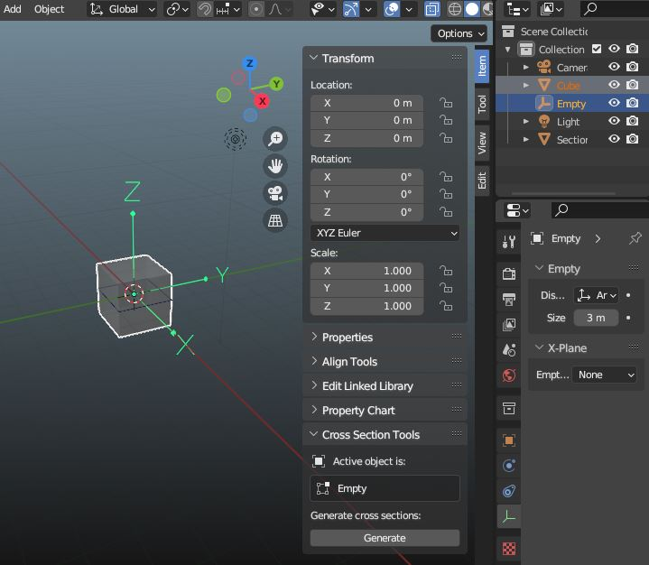
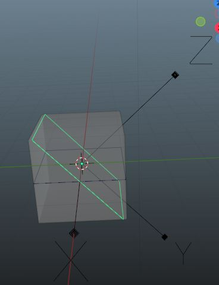

Tooling to generate Mesh Cross-Sections projected onto a plane at a selected location.

Tooling appears in the Edit/Object mode UI under "Cross Section Tools"

Selection should contain at least two objects the active object is taken as the definition 
for the cutting plane on which the cross-section will be projected. The X/Y axis define the plane and the Z the normal.
For each of the other selected components, if they are meshes, a cross-section mesh object named "Section(.n)" is 
generated if the plane cuts any part of the selected object.

The 'Generate' button will only activate if there are at least two selected items, and one of them is active. 
The Active object label will display the name of the object to be used as the cutting plane.

The second screenshot below shows a cross-section generated with the cutting plane rotated about the X axis

